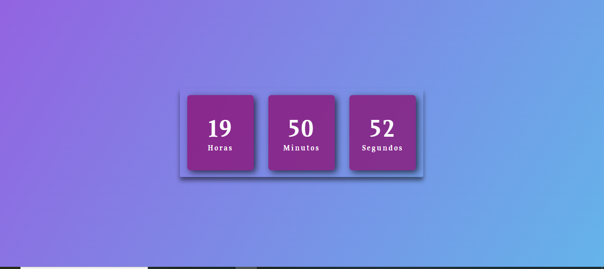

<h1 align="center"> Relógio Digital </h1>

Programa de uso exclusivo e gratuito.  
<a href="https://www.linkedin.com/in/andr%C3%A9-rolim-b8271b207/">Conheça mais sobre esse e outros projetos clicando aqui.</a>

  <a href="#-tecnologias">Tecnologias</a>&nbsp;&nbsp;&nbsp;|&nbsp;&nbsp;&nbsp;
  <a href="#-projeto">Projeto</a>&nbsp;&nbsp;&nbsp;|&nbsp;&nbsp;&nbsp;
  <a href="#-layout">Layout</a>&nbsp;&nbsp;&nbsp;
  

 

  

## 🚀 Tecnologias

Esse projeto foi desenvolvido com as seguintes tecnologias:

- HTML e CSS
- JavaScript
- Git e Github
- youtube

## 💻 Projeto

O relógio digital é uma ferramente que pode ser utilizada como proteção de tela para celulares, tabletes e computadores.

- [Acesse o projeto finalizado, online](https://andrerollim.github.io/relogio-digital/)

## 🔖 Layout

Você pode visualizar o layout do projeto através [DESSE LINK](https://www.youtube.com/watch?v=GK0ok3ZCXwM&list=LL).

---

Feito com ♥ by André Rolim :wave: